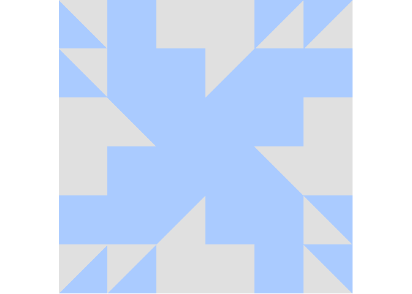
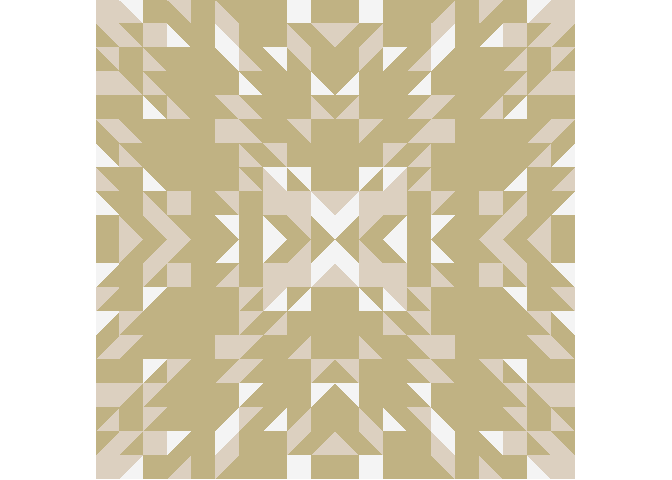

# quiltr 

## Overview

This package is used to create randomized, tesselation-based patterns
using isoceles right triangles. Pattern developments were inspired by
quilting designs.

## Installation

The current way to install this package is only through GitHub:

``` r
if (!require("devtools")) install.packages("devtools")
devtools::install_github("btmonier/quiltr")
```

## Usage

To get a randomize quilting “data set”, simply use the following:

``` r
qDS <- quiltr::quiltr()
```

With this object, basic S3 methodologies can be implemented:

``` r
print(qDS)
#> A quiltr data set:
#>   Class..... quiltr 
#>   Dim (x)... 3 
#>   Dim (y)... 3

summary(qDS)
#> Color usage:
#>    #AACBFF [==========---------------] (28) 
#>    #E0E0E0 [===============----------] (44) 
#> ---
#> Total units: 72
```

Probably the most important method to use would be `plot()`:

``` r
plot(qDS)
```

<!-- -->

To generate larger canvases with customized colors and probabilities, we
can use the following implementation:

``` r
# Plot with unequal color probabilities
qds <- quiltr::quiltr(
    x    = 10,
    y    = 10,
    col  = c("#DCD0C0", "#C0B283", "#F4F4F4"),
    prob = c(0.2, 0.7, 0.1)
)
plot(qds, sym = "reflect")
```

<!-- -->

-----

*Last updated:* 2019-02-16
